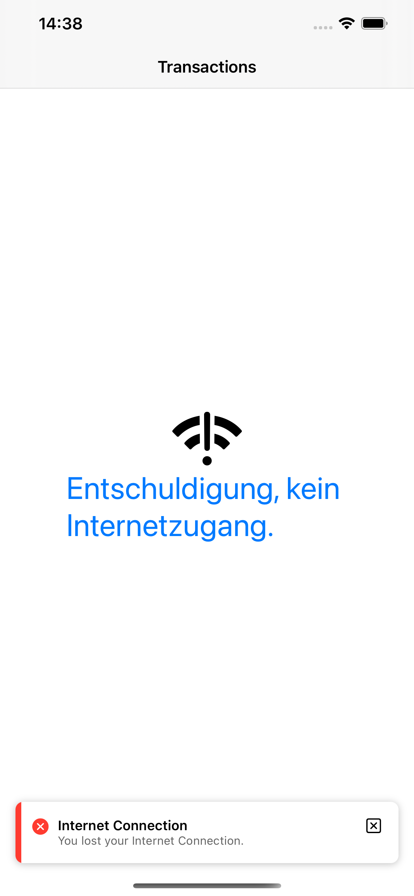

# WorldOfPAYBACK

* A list of Transactions, which can be sorted through the button at the top left & reset to the way it was through the button at the top right.

* Makes a network call to the provided url, if it's not available, it will read the data from the provided json file.

* It will show a NoNetwork view when internet isn't available.

* Via the floating button at the bottom right, Menu, you can filter the data ("category" key.).

* I will filter additional data if you just add the "category" key to the `enum` in `TransactionModel`.

* Sum of the Values is show at the bottom, which will change when you choose a different category in the menu.

* The app follows MVVM Design Pattern.

